# Домашнее задание к занятию 4 "`Оркестрация группой Docker контейнеров на примере Docker Compose`" - `Поздникин Евгений`


### Инструкция по выполнению домашнего задания

   1. Сделайте `fork` данного репозитория к себе в Github и переименуйте его по названию или номеру занятия, например, https://github.com/имя-вашего-репозитория/git-hw или  https://github.com/имя-вашего-репозитория/7-1-ansible-hw).
   2. Выполните клонирование данного репозитория к себе на ПК с помощью команды `git clone`.
   3. Выполните домашнее задание и заполните у себя локально этот файл README.md:
      - впишите вверху название занятия и вашу фамилию и имя
      - в каждом задании добавьте решение в требуемом виде (текст/код/скриншоты/ссылка)
      - для корректного добавления скриншотов воспользуйтесь [инструкцией "Как вставить скриншот в шаблон с решением](https://github.com/netology-code/sys-pattern-homework/blob/main/screen-instruction.md)
      - при оформлении используйте возможности языка разметки md (коротко об этом можно посмотреть в [инструкции  по MarkDown](https://github.com/netology-code/sys-pattern-homework/blob/main/md-instruction.md))
   4. После завершения работы над домашним заданием сделайте коммит (`git commit -m "comment"`) и отправьте его на Github (`git push origin`);
   5. В личном кабинете прикрепите и отправьте ссылку на решение в виде md-файла в вашем Github.
   6. Любые вопросы по выполнению заданий спрашивайте в разделе “Вопросы по заданию” в личном кабинете.
   
Желаем успехов в выполнении домашнего задания!
   
### Дополнительные материалы, которые могут быть полезны для выполнения задания

1. [Руководство по оформлению Markdown файлов](https://gist.github.com/Jekins/2bf2d0638163f1294637#Code)

---

### Задание 1
Загружен образ на докерхаб
https://hub.docker.com/repository/docker/enpozdnikin/custom-nginx/general


---

### Задание 2
Запускаю контейнер, переименовываю его и запускаю команды демонстрации 

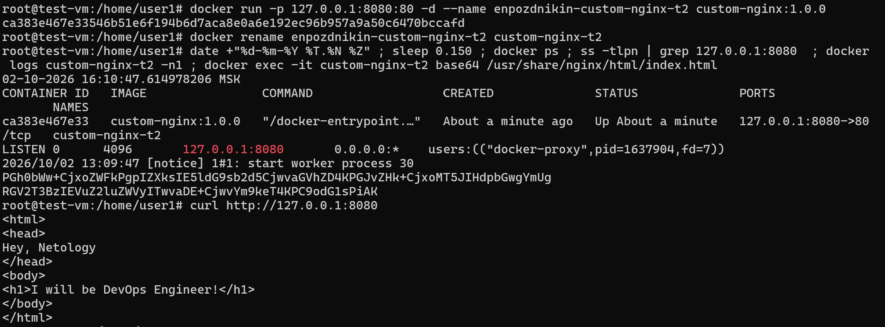

---

### Задание 3
Подключаюсь к стандартному потоку ввода/вывода/ошибок контейнер 

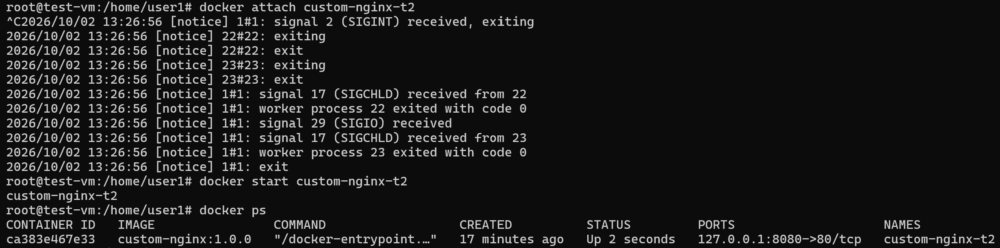

После подключения к стандартному потоку ввода/вывода/ошибок контейнера "custom-nginx-t2" нажав комбинацию Ctrl-C был послан сигнал SIGINT — сигнал прерывания, который сообщает процессу, что мы хотим его прервать.

Устанявливаю nano

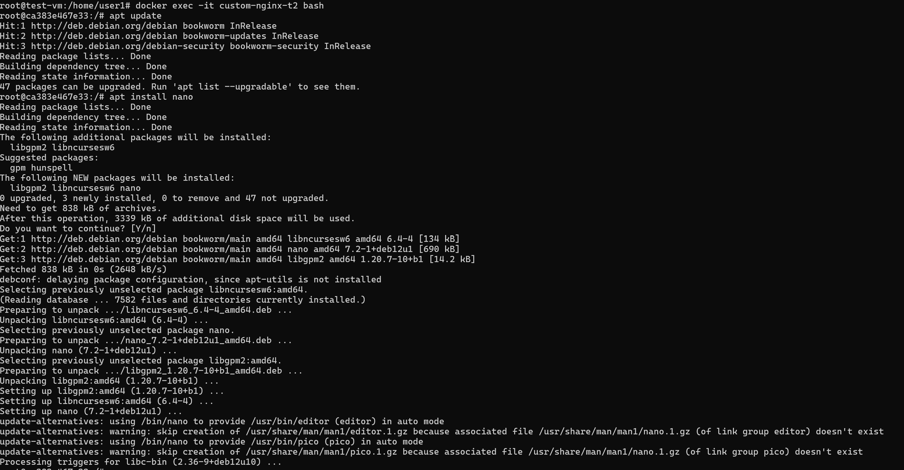

Меняю порт Nginx
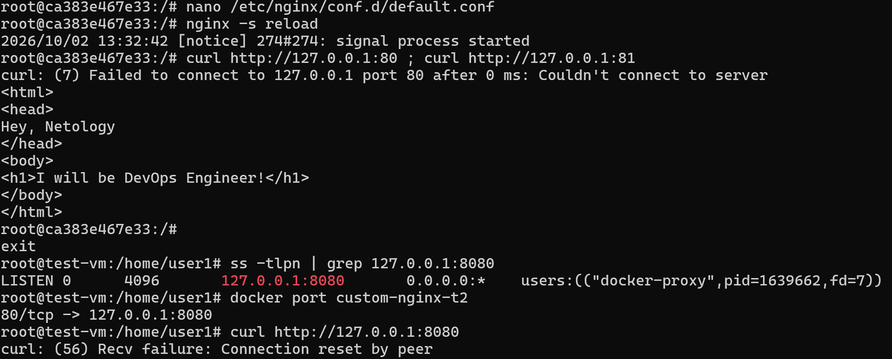

Суть проблемы состоит в том что мы поменяли конфигурацию nginx на другой порт, и старый порт он больше не слушает, в то время как докер сконфигурирован таким образом, что проброс локального порта ссылается на тот что мы задали изначально.

Докер не имеет возможности править порты стандартным путем и в его понимании эта проблема решается пересозданием контейнера с указанием нужных значений.
Это не удобно по разным причинам, например мы не хотим терять данные или просто не хотим.
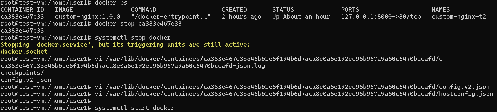

Но есть обходной путь а именно поправить порт руками в файлах hostconfig.json и config.v2.json которые лежат в расположении контейнера. Для этого придется остановить конейнер и службу docker.

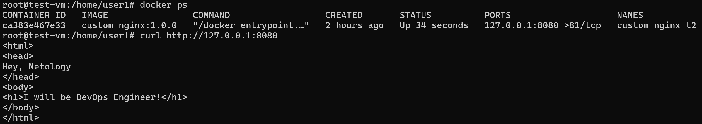

Проверяем.

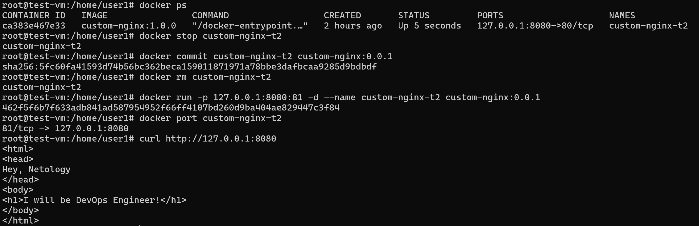

Есть еще способ, который подошел бы если нам разрешили удалить контейнер а именно сохранить текущее состояние в образ и развернуться из него с указанием нужных параметров.
Не плохой, более простой, не надо останавливать докер и искать файлы. 
Но контейнер был бы уже с другим образом и другой датой создания. 
В общем метод зависит от цели и задач.


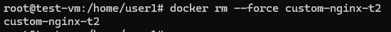

Для удаления без остановки стандартному удалению контейнера `docker rm <имя_контейнера>` нужно добавить флаг `--force` или коротко `-f`
 
---

### Задание 4

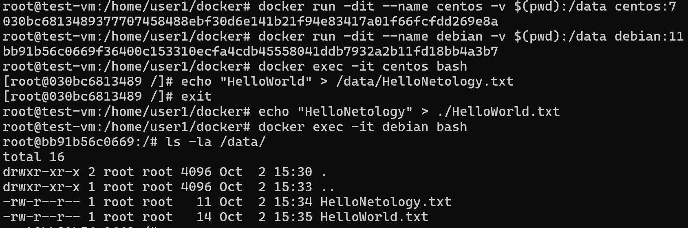

---

### Задание 5
Запускаю docker compose up -d
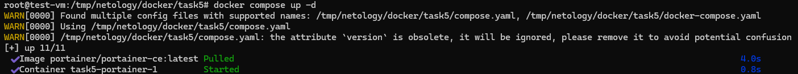

Запустился compose.yaml потому как в новых версиях docker compose этот файл главный, второй файл (старая версия) будет использоваться в случае отсутствия первого 
Вношу изменения в файл compose.yaml
[compose.yaml](compose.yaml)

добавляю секцию чтобы были запущенны оба файла
```
include:
  - docker-compose.yaml
```

Запустился и второй 

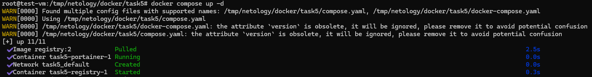

Готовлю образ и гружу в наше реджистри 

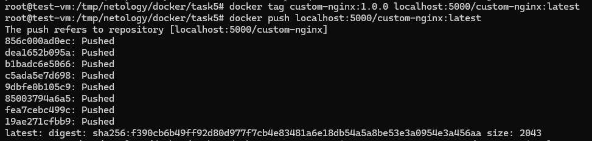

Захожу в логи для поиска токена 

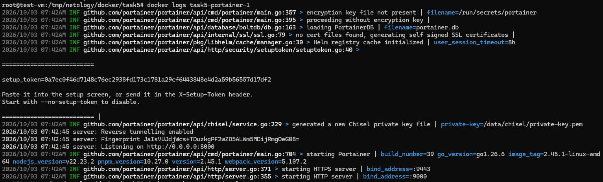

Перехожу в "stacks" и в "web editor"

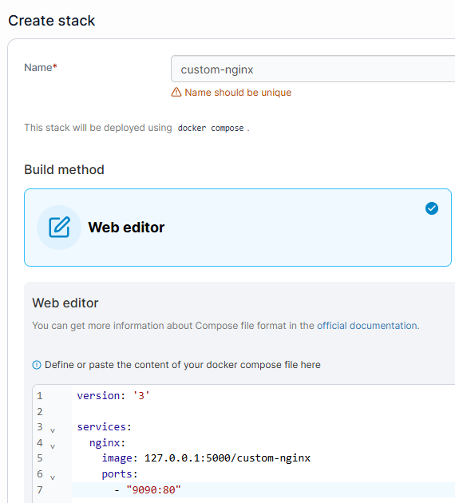

Компоуз задеплоен  

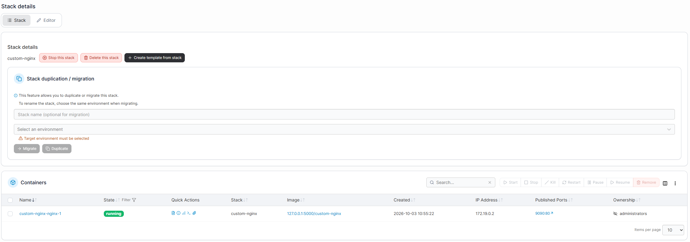  

Демонстрация "inspect"  

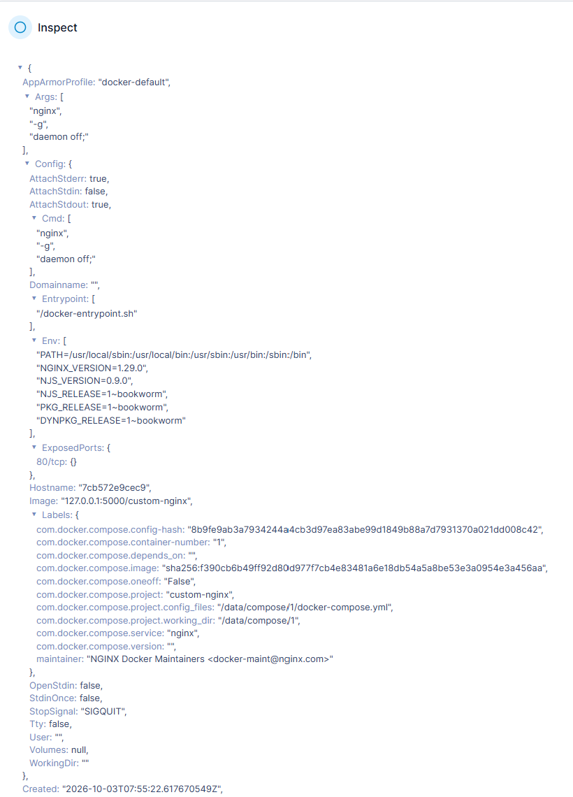

Удаляю манифест compose.yaml и выполняю  `docker compose up -d`
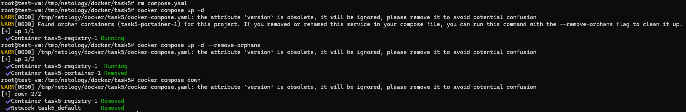

При попытке синхронизировать состояние контейнеров с состоянием манифеста докер не увидел манифеста compose.yaml и синхронизировался с обратно совместимым устаревшим docker-compose.yaml при этом он отметил в warning что есть осиротевшие контейнеры в этом проекте от удаленного или переименованного сервиса (поскольку не обнаружил его в своем манифесте) и предложил запустить ту же команду (docker compose up -d) с флагом  `--remove-orphans` для очистки. По условиям задачи мы это применяем и для остановки проекта остается сделать `docker compose down`

Иначе можно сразу сделать `docker compose down  --remove-orphans`
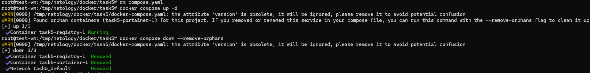


